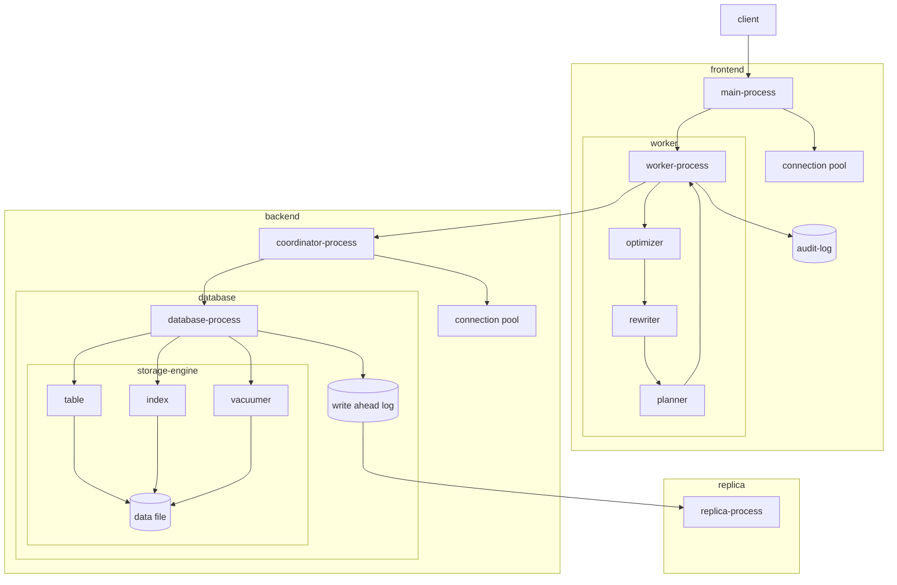

# Kosmo

Kosmo is a simple Relational Database implemented in Kotlin.
This product is not developed for production use, just for personal learning.

## Architecture

```mermaid
graph TD
  subgraph frontend
    main-process --> cpf[connection pool]
    subgraph worker
        worker-process -->
        optimizer -->
        rewriter -->
        planner --> worker-process
    end
    main-process --> worker-process
    worker-process --> al[(audit-log)]
  end
  subgraph backend
    coordinator-process --> cpb[connection pool]
    subgraph database
        database-process
        wal[(write ahead log)]
        subgraph storage-engine
            table --> df[(data file)]
            index --> df
            vacuumer --> df
        end
        database-process --> wal
        database-process --> table
        database-process --> index
        database-process --> vacuumer
    end
  end
  subgraph replica
    wal --> replica-process
  end
  client --> main-process
  worker-process --> coordinator-process --> database-process
```
